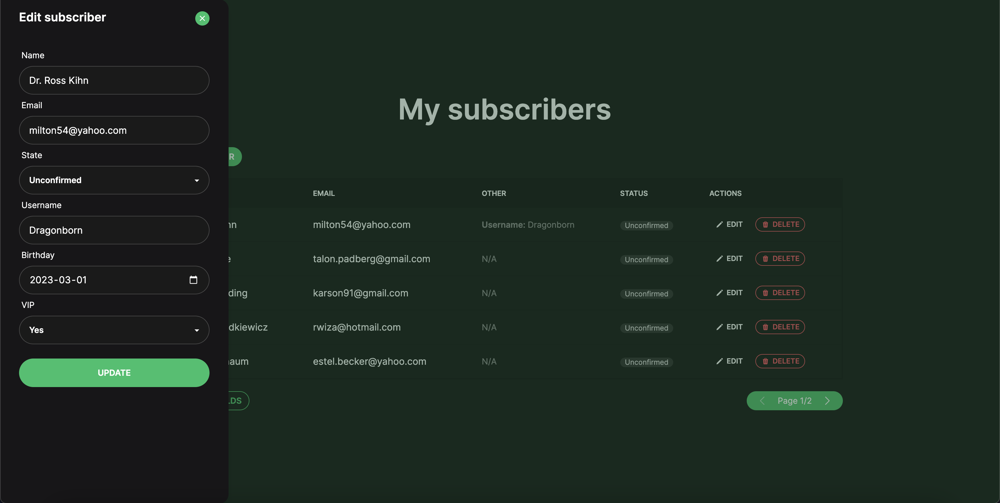

<div align="center">
  <h1>MailerLite Laravel developer task</h1>
  
  <p>
    This project is an submission for a real Laravel/Vue Developer task used for Laravel/Vue developer recruitment at MailerLite.
    It is not intended to be used as a standalone project (although it could be used as a starter boilerplate), rather, it as an example of code quality, features and capabilities and is intedned to be used as a playground for educational purposes.
  </p>
</div>

<br />
    
<!-- The task -->
## :star2: The task
The task to submit was to create an API for managing two resources and their relations: subscribers and fields as well as front-end for integrating the API.

<!-- About the Project -->
## :star2: About the Project

<div align="center"> 
  
</div>


<!-- TechStack -->
### :space_invader: Tech Stack

<details>
  <summary>Client</summary>
  <ul>
    <li><a href="https://www.typescriptlang.org/">Typescript</a></li>
    <li><a href="https://vuejs.org/">Vue.js 3 (Composition API)</a></li>
    <li><a href="https://pinia.vuejs.org/">Pinia</a></li>
    <li><a href="https://tailwindcss.com/">Tailwind CSS</a></li>
    <li><a href="https://daisyui.com/">daisyUI</a></li>
    <li><a href="https://heroicons.com/">Heroicons</a></li>
    <li><a href="https://vitest.dev/">Vitest</a></li>
  </ul>
</details>

<details>
  <summary>Server</summary>
  <ul>
    <li><a href="https://laravel.com/">Laravel 9</a></li>
    <li><a href="https://pestphp.com/">Pest</a></li>
  </ul>
</details>

<details>
<summary>Database</summary>
  <ul>
    <li><a href="https://www.sqlite.org/">SQLite</a></li>
  </ul>
</details>

<!-- Features -->
### :dart: Features

- Create subscribers with custom fields
- Manage custom fields
- Paginated table for listing subscribers
- Dark mode
- Front-end tests with Vitest
- Feature / Unit test with Pest
- Brotli compress for front-end production files


<!-- Env Variables -->
### :key: Environment Variables

.env file is commited intentionally as it was the requirement for the task, therefore, you can just pull and launch the project real fast.<br />
(Front-end production build files are included as well, as this was a task requirement in case any enviroment compatibility issues would occur)


<!-- Getting Started -->
## 	:toolbox: Getting Started

<!-- Prerequisites -->
### :bangbang: Prerequisites

This project uses Yarn as a package manager

<!-- Run Locally -->
### :running: Run Locally

Clone the project

```bash
  git clone https://github.com/butaminas/mailerlite-laravel-developer-task.git
```

Go to the project directory

```bash
  cd mailerlite-laravel-developer-task
```

Install dependencies

```bash
  composer install
```
    
Run migrations

```bash
  php artisan migrate:fresh --seed
```

Start the server

```bash
  php artisan serve
```
    
<!-- Run Dev -->
### :zap: Additional steps for front-end development

Install dependencies

```bash
  yarn install
```

Run vite dev server

```bash
  yarn dev
```
    
Build production files

```bash
  yarn build
```
    
    
<!-- Run Tests -->
### :boom: Run tests

Install dependencies (if haven't already)

```bash
  yarn install && composer install
```

Run vitest

```bash
  yarn vitest --run
```

Run pest

```bash
  php artisan test
```
